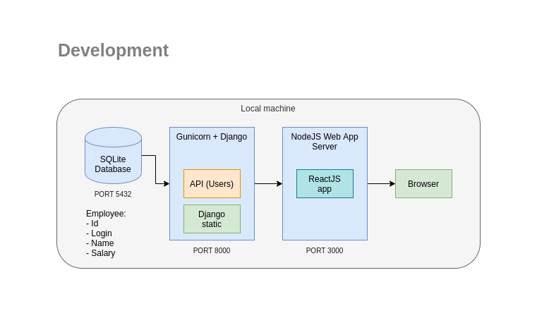
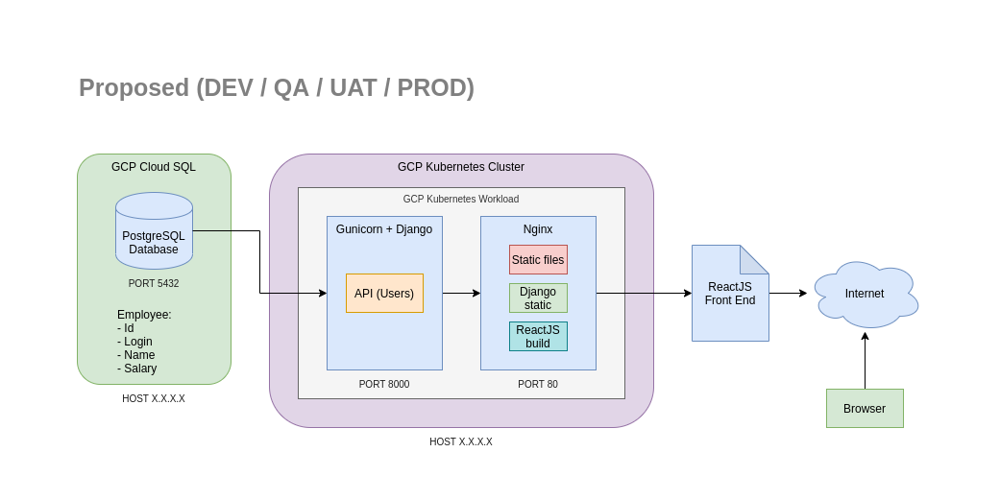
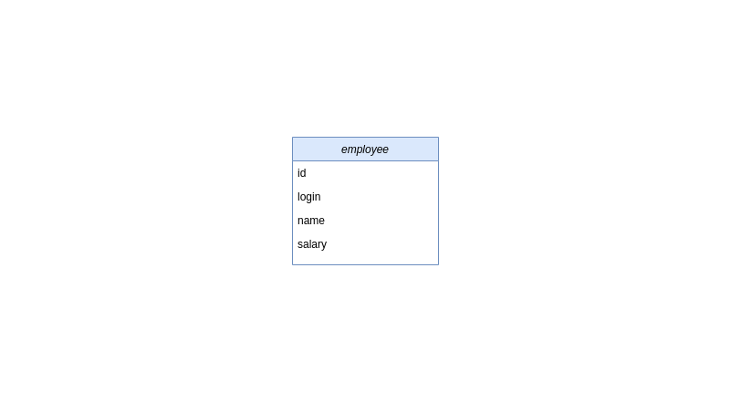

# Employee Salary Management System 

# Install using Docker (Recommended)

## 1. Clone Git repository
```
~ $ git clone https://github.com/alanwuha/techhunt
```

## 2 Install Docker
```
~ $ sudo apt install docker
```

## 3. Build Docker images
```
~ $ cd techhunt
~ techhunt $ docker build -t techhunt_backend backend
~ techhunt $ docker build -t techhunt_frontend frontend
```

## 4. Run Docker images
On one command line interface window or tab, run:
```
~ techhunt $ docker run -p 8000:8000 techhunt_backend
```
_Note that nothing is printed after the command is executed, but it should be working!_


On another command line interface window or tab, run:
```
~ techhunt $ docker run -p 3000:3000 techhunt_frontend
```

If successful, you should be able to access:
- Backend : [http://localhost:8000/users/?minSalary=0&maxSalary=1000000&offset=0&limit=30&sort=+id](http://localhost:8000/users/?minSalary=0&maxSalary=1000000&offset=0&limit=30&sort=+id)
- Frontend: [http://localhost:3000/](http://localhost:3000/)

# Install Manually

## 1. Clone Git repository
```
~ $ git clone https://github.com/alanwuha/techhunt
```

## 2. Django Backend

### Install Python 3.6
```
~ $ sudo apt install python3.6
```

Verify that Python 3.6 is installed
```
~ $ python3.6 --version
```
```
Output
Python 3.6.9
```

### Set up and activate virtual environment
```
~ $ cd techhunt/backend
~/techhunt/backend $ virtualenv --python=python3.6 env
~/techhunt/backend $ source env/bin/activate
```

Your environment should be changed with `(env)` prepended on every command line like below.
```
(env) ~/techhunt/backend $ 
```

### Install python packages using pip
```
(env) ~/techhunt/backend $ pip install -r requirements.txt
```

### Create Database

As we're using Django's database API functionality, we'll need to make sure a database server is running. Typically we'll want to use full fledged databases such as PostgreSQL, MariaDB or MySQL for a fully operational app but since this is a simple demo project, we'll stick to SQLite for now. Creation of our database instance will be managed using our Django app.

Run the following command to create our SQLite database locally.
```
(env) ~/techhunt/backend $ cd mysite
(env) ~/techhunt/backend/mysite $ python manage.py migrate
(env) ~/techhunt/backend/mysite $ python manage.py migrate salary
```

### Start the Django server
```
(env) ~/techhunt/backend/mysite $ python manage.py runserver
```

If successful, you should be able to access [http://localhost:8000/users/?minSalary=0&maxSalary=1000000&offset=0&limit=30&sort=+id](http://localhost:8000/users/?minSalary=0&maxSalary=1000000&offset=0&limit=30&sort=+id) on your browser. Yay!

## 3. ReactJS Frontend

### Install NodeJS
```
~ $ sudo apt install nodejs
```

Verify that NodeJS is installed
```
~ $ node -v 
```
```
Output
v10.20.1
```

### Install node modules
```
~ $ cd techhunt/frontend
~ techhunt/frontend $ npm install
```

### Start the NodeJS server
```
~ techhunt/frontend $ npm start
```

If successful, you should be able to access [http://localhost:3000/](http://localhost:3000/) on your browser. Yay!

If unsuccessful, try deleting the `node_modules` folder and run `npm install` followed by `npm start` again.


# Assumptions

User Story 1
- Since this is a prototype, I've sticked to using SQLite as the database for now. We can easily migrate over to production ready ones such PostgreSQL or MySQL at a later time.
- I've set `minSalary` to `0` and `maxSalary` to `1000000` as default on the frontend to retrieve all employees as they're required fields by the API
- For upload, I've also added a condition to ignore empty lines apart from comments.
- As the min and max lengths of `id`, `login` and `name` was not specified, I've imposed a max length of `5` on `id` and `100` on `name` and `login`, and a min length of `1` for all three fields in the database for now. Once the min and max lengths are confirmed, we can easily do a database migration to update the lengths in the database.

User Story 2
- There is currently no UI to change the fetch limit on the frontend as it was not mentioned in the document and also not included in the mockup.
- For GET/ `users` API, apart from `results`, I've added 4 other fields `count`, `next_offset`, `previous_offset`, and `limit` to achieve pagination on the frontend.

User Story 3
- No assumptions made

User Story 4
- No assumptions made

User Story 5
- Not attempted

# Test

## Django
Make sure that you have set up and activated a virtual env, and installed the required python packages using pip as per the steps under `Install Manually`
```
~ (env) techhunt/backend/mysite $ python manage.py test
```

# Notes

## Architecture Design

### Local Development



The current setup is as such where most of the development work is done on our local machine. As this is just a prototype, we are using SQLite for our database. Django automatically handles creating, reading, and writing to our SQLite database out of the box.

We'll serve our Django app using Django's runserver, and our ReactJS app using a NodeJS server, both on our local machine. Refer to Installation guide above on how to run the source code locally.

### Deployment (Proposed)



The proposed system architecture is as such. We will have `4` environments namely `development` (DEV), `quality assurance` (QA), `user acceptance test` (UAT), and `production` (PROD). All 4 environments will deploy using the same architecture as shown above.

As I am a huge fan of Google Cloud Platform, we shall make use of `Cloud SQL` to host and manage our PostgreSQL database instances and `Kubernetes Engine` to deploy our entire app on a single cluster and workload.

One great thing about `Cloud SQL` is that you can easily add high availability to your instances and/or create read replica instances. This would ensure that our systems are durable and likely to operate continuously without failure for a long time and in the case of any system failure (touch wood!), our data is not lost.

We use `Kubernetes Engine` to achieve Continuous Delivery and Continuous Integration (CICD). With the help of _build triggers_, any commits to our repository on the trigger branches such as the `master` branch will start a new build instance which will build and push a new Docker image of our app to the `Cloud Registry` followed by a deployment of the new image on the engine.

It is recommended to use `Gunicorn` behind a proxy server, hence we will use `Nginx` as our proxy server which will also host and serve our Django and ReactJS static and index files as well.

## DB schema design



Our database schema design for now is simply a single `Employee` entity with `4` fields namely `id` (varchar), `login` (varchar), `name` (varchar), and `salary` (numeric)
